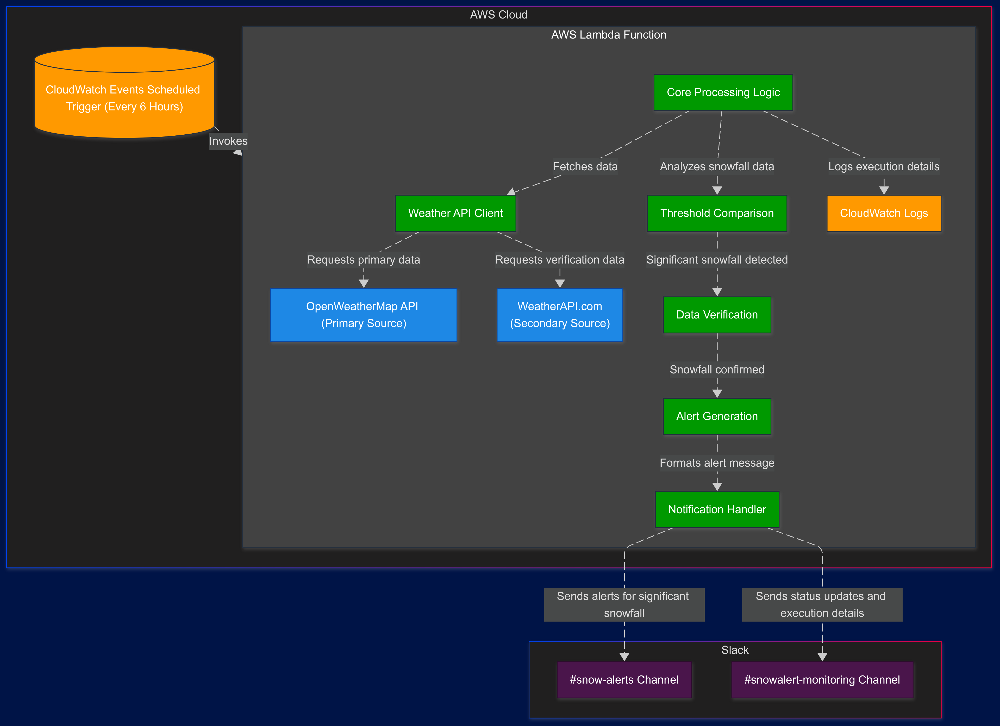

# Snowfall Alert System

A lightweight, serverless application that monitors real-time snowfall conditions at ski resorts near Park City, Utah, and sends notifications via Slack when significant snowfall occurs.

[](https://www.python.org/downloads/release/python-390/)
[](https://aws.amazon.com/lambda/)
[](https://aws.amazon.com/cloudwatch/)
[](https://openweathermap.org/api)
[](https://www.weatherapi.com/)
[](https://api.slack.com/messaging/webhooks)
[](https://www.docker.com/)
[](https://docs.pytest.org/)

## Created By

👩‍💻 Dr. Jody-Ann S. Jones ❄️

[](https://www.drjodyannjones.com)
[](https://www.drjodyannjones.com)
[](mailto:jody@thedatasensei.com)
[](https://github.com/dasdatasensei)

## Overview

The Snowfall Alert System automatically checks snowfall data for approximately 10 ski resorts within a 100-mile radius of Park City every 6 hours. When fresh snow accumulation exceeds your configured thresholds, you'll receive a Slack notification, helping you plan your perfect powder day.

## Features

- **Real-time Snowfall Monitoring**: Tracks current and forecasted snow conditions at major ski resorts near Park City.
- **Custom Alert Thresholds**: Configure your own snowfall thresholds for light, moderate, and heavy snow alerts.
- **Cross-verification**: Uses multiple weather data sources to confirm snowfall amounts and reduce false positives.
- **Slack Notifications**: Delivers timely alerts directly to your Slack channel.
- **Serverless Architecture**: Runs entirely on AWS Lambda for reliability and minimal cost.
- **Completely Free**: Operates within free tier limits of all services.

## System Architecture

The system consists of two main components:

1. **AWS Lambda Function**: Python-based serverless function that retrieves and processes weather data.
2. **Slack Webhooks**: Handles the delivery of notifications to your Slack workspace.



## Getting Started

### Prerequisites

- AWS account
- OpenWeatherMap API key
- Weather API key
- Slack workspace with webhook URL
- Python 3.9 or higher
- pip (Python package installer)

### Installation

#### 1. Clone the Repository

```bash
git clone https://github.com/dasdatasensei/snowfall-alert-system.git
cd snowfall-alert-system
```

#### 2. Install Dependencies

```bash
pip install -r src/requirements.txt
```

#### 3. Configure API Keys

Create a `.env` file in the root directory with your API keys:

```
OPENWEATHER_API_KEY=your_openweathermap_api_key
WEATHERAPI_KEY=your_weatherapi_key
SLACK_WEBHOOK_URL=your_slack_webhook_url
SLACK_MONITORING_WEBHOOK_URL=your_slack_monitoring_webhook_url
```

#### 4. Configure Resort Information

Review and update the resort coordinates in `src/config/resorts.py` if needed.

#### 5. Configure Alert Thresholds

Adjust snowfall thresholds in `src/config/thresholds.py` according to your preferences:

```python
THRESHOLDS = {
    "light": 2,      # 2+ inches in 24 hours
    "moderate": 6,   # 6+ inches in 24 hours
    "heavy": 12      # 12+ inches in 24 hours
}
```

#### 6. Set Up Slack

- Create a Slack app in your workspace
- Enable incoming webhooks
- Create a webhook URL for your notification channel
- Set the SLACK_WEBHOOK_URL environment variable with this URL
- Optionally, create a separate webhook for monitoring alerts and set SLACK_MONITORING_WEBHOOK_URL

#### 7. Deploy the Lambda Function

```bash
cd infrastructure/aws
./deploy.sh
```

This script packages the Lambda function and deploys it to AWS using the AWS CLI.

### Using the Makefile

The project includes a Makefile with common development tasks. To see all available commands:

```bash
make help
```

#### Common Tasks

1. **Set up development environment**:

   ```bash
   make setup
   ```

2. **Run tests**:

   ```bash
   make test
   ```

3. **Package and deploy to AWS Lambda**:

   ```bash
   make deploy
   ```

4. **Local development**:

   ```bash
   make dev
   ```

5. **Code quality checks**:

   ```bash
   make lint
   ```

6. **Clean up build artifacts**:

   ```bash
   make clean
   ```

7. **Test Slack notification**:
   ```bash
   make check-slack
   ```

### Testing the System

To verify that everything is working correctly:

```bash
python tests/test_integration.py
```

This will simulate a snowfall event and send a test notification to your Slack channel.

## Usage

Once deployed, the system operates automatically. The Lambda function runs every 6 hours, checking for fresh snowfall. When snow accumulation exceeds your thresholds, you'll receive a notification with the resort name and snowfall amount.

## Customization

### Adding New Resorts

To add a new resort, update the `RESORTS` dictionary in `src/config/resorts.py`:

```python
RESORTS = {
    # Existing resorts...
    "New Resort Name": (latitude, longitude),
}
```

### Modifying Check Frequency

To change how often the system checks for fresh snow, update the CloudWatch Events schedule in the AWS Console or modify the `schedule_expression` in `infrastructure/terraform/main.tf`.

## Project Structure

The project follows a modular structure with clear separation of concerns:

```
snowfall-alert-system/
├── docs/                   # Documentation
├── src/                    # Source code
│   ├── weather/            # Weather data retrieval and processing
│   ├── notifications/      # Notification handling
│   ├── config/             # Configuration
│   ├── utils/              # Utility functions
│   ├── lambda_function.py  # Main Lambda handler
│   └── requirements.txt    # Python dependencies
├── tests/                  # Test suite
├── mobile/                 # Android application
│   └── android/            # Android project
├── infrastructure/         # Deployment resources
│   ├── terraform/          # Infrastructure as Code
│   └── aws/                # AWS deployment files
└── README.md               # This file
```

## Monitoring and Maintenance

### Checking Lambda Execution

View CloudWatch Logs for the Lambda function to verify execution and diagnose any issues:

```bash
aws logs get-log-events \
  --log-group-name /aws/lambda/SnowfallAlertFunction \
  --log-stream-name $(aws logs describe-log-streams \
                      --log-group-name /aws/lambda/SnowfallAlertFunction \
                      --order-by LastEventTime \
                      --descending \
                      --max-items 1 \
                      --query 'logStreams[0].logStreamName' \
                      --output text)
```

### API Usage Monitoring

Check your API usage to ensure you stay within free tier limits:

- OpenWeatherMap: Visit your account dashboard at OpenWeatherMap
- Weather API: Check your usage statistics in your Weather API account

## Troubleshooting

### No Notifications

If you're not receiving notifications:

1. Verify the Lambda function is executing successfully in CloudWatch Logs
2. Check that your Slack webhook URL is correctly configured in the Lambda environment variables
3. Ensure the Slack app has the necessary permissions
4. Try sending a test message to your webhook URL

## License

This project is licensed under the [MIT License](LICENSE) - see the LICENSE file for details.

Copyright © 2025 [Dr. Jody-Ann S. Jones](https://www.drjodyannjones.com). All rights reserved.

## Acknowledgments

- OpenWeatherMap for providing weather data
- Weather API for secondary data verification
- AWS for Lambda and CloudWatch services
- Slack for notification delivery
- All the amazing ski resorts near Park City for the great powder days!

## Security and Environment Variables

### Important Security Considerations

1. **Never commit .env files to version control**

   - The repository includes a `.env.example` file which should be copied to `.env` for local development
   - All actual `.env` files are gitignored

2. **No hardcoded secrets**

   - All credentials, API keys, and sensitive configuration are provided via environment variables
   - The system validates environment variables at startup to ensure nothing is hardcoded

3. **Environment-specific configurations**
   - Development: `.env`
   - Testing: `.env.test`
   - Production: `.env.prod`

### Setting Up Environment Variables

1. Copy the example environment file:

   ```bash
   cp .env.example .env
   ```

2. Edit the `.env` file and fill in your actual values:

   ```
   # API Keys
   OPENWEATHER_API_KEY=  # Your actual OpenWeatherMap API key
   WEATHERAPI_KEY=       # Your actual WeatherAPI key

   # Slack integration
   SLACK_WEBHOOK_URL=    # Your Slack webhook URL
   ```

3. For testing or production environments, create the appropriate files:

   ```bash
   cp .env.example .env.test
   cp .env.example .env.prod
   ```

4. Edit each file with the appropriate values for that environment.

## Docker Considerations

All Docker Compose files are designed to use environment variables without defaults:

- `docker-compose.yml` - Development environment
- `docker-compose.test.yml` - Testing environment
- `docker-compose.prod.yml` - Production environment

Environment variables are passed to containers through the `env_file` directive and individual environment variables.
